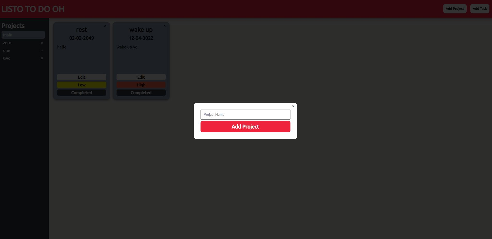

# TheOdinProject - To Do List Project

This is a solution to the [Project: TODO LIST](https://www.theodinproject.com/lessons/node-path-javascript-todo-list). 

## Table of contents

- [Overview](#overview)
  - [The challenge](#the-challenge)
  - [Screenshot](#screenshot)
  - [Links](#links)
- [My process](#my-process)
  - [Built with](#built-with)
  - [What I learned](#what-i-learned)
  - [Continued development](#continued-development)
  - [Useful resources](#useful-resources)
- [Author](#author)


## Overview

### The challenge

- Your ‘todos’ are going to be objects that you’ll want to dynamically create, which means either using factories or constructors/classes to generate them.
- Brainstorm what kind of properties your todo-items are going to have. At a minimum they should have a title, description, dueDate and priority. You might also want to include notes or even a checklist.
- Your todo list should have projects or separate lists of todos. When a user first opens the app, there should be some sort of ‘default’ project to which all of their todos are put. Users should be able to create new projects and choose which project their todos go into.
- You should separate your application logic (i.e. creating new todos, setting todos as complete, changing todo priority etc.) from the DOM-related stuff, so keep all of those things in separate modules.
- The look of the User Interface is up to you, but it should be able to do the following:
view all projects
view all todos in each project (probably just the title and duedate.. perhaps changing color for different priorities)
expand a single todo to see/edit its details
delete a todo
- We haven’t learned any techniques for actually storing our data anywhere, so when the user refreshes the page, all of their todos will disappear! You should add some persistence to this todo app using the Web Storage API.


### Screenshot




### Links

- Solution URL: [https://github.com/TheLegend760/Todo-List-TheOdinProject]
- Live Site URL: [https://listo-to-do-oh.netlify.app/]

## My process

### Built with

- Semantic HTML5 markup
- CSS custom properties
- Flexbox
- Vanilla Javascript


### What I learned

I am proud to be able to learn how you can pass main function parameters to inside function parameters. I had a hard time figuring out on how arrays worked, specifically 
how to find arrays and delete them. While doing some research I was able to find out as long I know the value of the item I can use .findIndex() function to find the index
of the array or object you want and adjust it to your liking. Below is the createFullTask function that allowed me to figure how passing a parameter to the inside function I was
able to find the index of the project to the task.

An idea I had is a to create as task modal and have it show all the options to select what project the user wants to the task to. I found a solution where
it find out how many project arrays there is and created option element with the value and name of the array in it.

Working on the date input I found out that the date is set to a different placement. So I was able to read throught the date-fns and figured out how the format function worked.

After completing the website, I had to create it to where it can be saved on Local Storage. At first my thought process is that I had to redo the whole thing,
but after brain storming. I created a way it easy to setItem and getItem anytime the array was being adjusted.


```js
 function createFullTask(array, project, name, date, descript, priority, complete) {

    const newTask = createTask(name, date, descript, priority, complete);
    // Find the project array index
    const findProjectIndex = array.findIndex(e => e[0] == project);
    // Pushes the task on the project
    array[findProjectIndex].push(newTask);
 };

  // Creates Options for form select
 function createOption(name, appendTo) {
    const options = document.createElement('option');
    options.value = name;
    options.innerText = name;

    appendTo.append(options);
 };

 const tDate = format(new Date(taskDate.value), 'MM-dd-yyyy');


 function setLocal(array) {
    localStorage.setItem('projectArray', JSON.stringify(array))
};


function getLocal() {
   return JSON.parse(localStorage.getItem('projectArray'));
};
```


### Continued development

My continued development is to be able to write functions a lot cleared and more simple. I feel like my code has functions that are doing more than one thing, which I would like to work on.
I would so love to go more in depth with higher amounts of objects and arrays with more efficient and faster ways to adjust them.


### Useful resources

- [www.stackoverflow.com]
- [www.w3school.com]

Both websites allowed me to find solutions to the problems I was facing when it came down to handling arrays, objects, local storage, ect. Thank you for the people who asked the questions and the people
who answered them on stackoverflow.


## Author

- Twitter - [@CoderKevo](https://www.twitter.com/CoderKevo)


